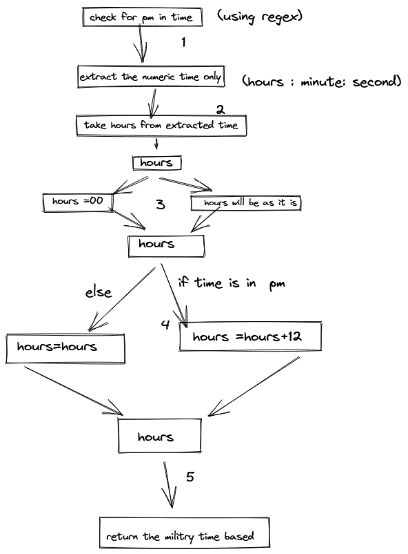

# flowchart for th problems

## bird flow chart


```js

function birdFrequency(arr){
    // empty arrays to store minimum and maximum occured birds
      let max=[]
      let min=[]
    //   Intializing empty  map object
      let map = new Map()
    // storing the birds id as key and no.of birds  as value
      arr.forEach((element)=>{
        if(map.has(element)){
        map.set(element,map.get(element)+1) 
        }
      else{
        map.set(element,1)
      }
    })
    //   getting all the no.of birds for unique id 
      let values= [...map.values()]
      let maxValue=Math.max(...values)
      let minValue=Math.min(...values)
    //   pushing the bird id for maximum and minimum numbers
     map.forEach((value,key)=>{
       if(value == maxValue){
         max.push(key)
       }
       if(value==minValue){
        min.push(key)
       }
     })
    //  returning  the bird with lowest id
    return [Math.min(...max),Math.min(...min)]
    }
    let inp1= [1,1,2,2,4,4,4,4,5] 
    let inp2=[2,2,2,2,4,4,4,4,5]
    let inp3=[1,2,2,4,4,4,4,5]
    
    birdFrequency(inp1) // [4,5]
    birdFrequency(inp2) // [2,5]
    birdFrequency(inp3) //  [4,1]
```

## militry problem



```js

     function militryTime(timeStr){
        //       check for pm in time
               const pm =/pm/ig.test(timeStr)
              //  extract the numeric time only 
               const [time]=timeStr.split(/pm|am/ig)
        //        getting hours .minutes and second
               let [hours,min,sec]=time.split(":")
                if (hours === "12") {
                  hours = "00";
                }
               if(pm){
                  hours = parseInt(hours, 10) + 12;
               }
               
        //        returning the militry time based 
               
               return `${hours}:${parseInt(min)+45}:${parseInt(sec)+45}`;
             }
             
        militryTime("12:01:00PM")
        militryTime("12:01:00AM")
```